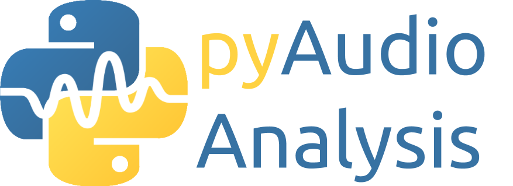

#  A Python library for audio feature extraction, classification, segmentation and applications

*This doc contains general info. Click [here](https://github.com/tyiannak/pyAudioAnalysis/wiki) for the complete wiki*

## News
 * Check out [pyVisualizeMp3Tags](https://github.com/tyiannak/pyVisualizeMp3Tags) a python script for visualization of mp3 tags and lyrics
 * Check out [paura](https://github.com/tyiannak/paura) a python script for realtime recording and analysis of audio data
 * [PLOS-One Paper regarding pyAudioAnalysis](http://journals.plos.org/plosone/article?id=10.1371/journal.pone.0144610) *(please cite!)*

## General
pyAudioAnalysis is a Python library covering a wide range of audio analysis tasks. Through pyAudioAnalysis you can:
 * Extract audio *features* and representations (e.g. mfccs, spectrogram, chromagram)
 * *Classify* unknown sounds
 * *Train*, parameter tune and *evaluate* classifiers of audio segments
 * *Detect* audio events and exclude silence periods from long recordings
 * Perform *supervised segmentation* (joint segmentation - classification)
 * Perform *unsupervised segmentation* (e.g. speaker diarization)
 * Extract audio *thumbnails*
 * Train and use *audio regression* models (example application: emotion recognition)
 * Apply dimensionality reduction to *visualize* audio data and content similarities

## Installation
 * Install dependencies:
 ```
pip install numpy matplotlib scipy sklearn hmmlearn simplejson eyed3 pydub
```
 * Clone the source of this library: 
 ```
git clone https://github.com/tyiannak/pyAudioAnalysis.git
```

## Use Case: Recognize Set of Spoken Words

Download and extract the speech commands dataset to the *wav* folder:

```
cd wav
wget http://download.tensorflow.org/data/speech_commands_v0.01.tar.gz
tar xvf speech_commands_v0.01.tar.gz
rm -f speech_commands_v0.01.tar.gz
```

Make sure the dataset folder is titled *speech_commands*

Now run ```python trainSpeechCommands.py``` to train an SVM model on the audio samples found in my-recordings. I recorded a few samples of myself saying a small set of words (yes, no, one, two, three) using a standard microphone. 

Currently the model only has 3 highlight samples to train on, far more samples need to be collected before the model shows any reasonable performance. More samples will be uploaded to this repository soon.


## Use Case: Recognize Sports Highlights

Run ```python trainGOALS.py``` to train an SVM model on the audio from the Spain vs. Portugal match in the 2018 World Cup.

Currently the model only has 3 highlight samples to train on, far more samples need to be collected before the model shows any reasonable performance. More samples will be uploaded to this repository soon.
